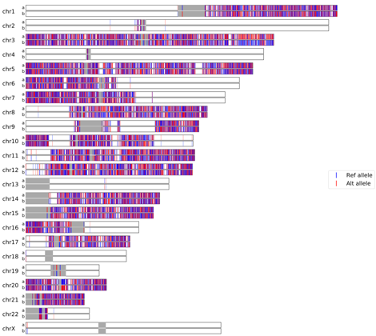
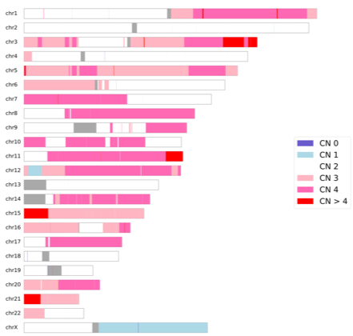

### A python tool for plotting SNV or CNV on chromosome ideogram

VariantPlotter.py is a tool for plotting phased SNV along a diploid genome in a chrommosome ideogram fashion. The input for variantPlotter is a standard VCF format (un-gzipped) and annotation files for chromosome sizes and cytobands (both can be otained via UCSC genome browser).

VariantPlotter.py also supports CNV plotting. The input for CNV plotting is a BED-format file with the fourth column specifying the copy numbers.

-------


### Requirements

```python
python 3
pysam
matplotlib
```


### Usage

```shell
variantPlotter.py [-h] [-t TYPE] [--chromsizes CHROMSIZES]
                         [--cytoband CYTOBAND] [-o O]
                         input

positional arguments:
  input                 A VCF file for SNV, or a BED file for CNV

optional arguments:
  -h, --help            show this help message and exit
  -t TYPE, --type TYPE  Types of variants to be drawn, currently supports snv
                        or cnv
  --chromsizes CHROMSIZES
                        A file with first column to be chromosome names, and
                        second column to be chromosome sizes
  --cytoband CYTOBAND   A file that specifies the genomic coordinates of
                        cytobands, can be downloaded from UCSC table browser
  -o O                  Name for the output PDF file
```


### Examples

Example of SNV plotting:



Example of CNV plotting:



